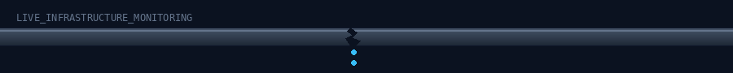

<div align="center">


### Bridging the gap between citizens and city governments — one pothole, one pipeline, one report at a time.

[](https://civix-orcin.vercel.app)
[](#-license)
[](#-roadmap)

</div>

<br>

## `$ What CiviX Actually Is`

Every city runs on infrastructure that quietly fails in small ways every day a pothole that swallows a tire, a streetlight that's been dead for three weeks, a water pipe leaking under a sidewalk, garbage that didn't get collected on schedule. None of these are emergencies on their own. But collectively, unreported and untracked, they're exactly what makes a city feel neglected.

The problem has never really been a lack of citizens willing to report these things. It's that **the reporting channel itself is broken** - a phone call nobody picks up, a form that disappears into a void, a complaint with no reference number and no way to check if anyone ever looked at it. When there's no structured record of a report, there's no way to measure response time, no way to prioritize the issue that's actually dangerous over the one that's merely annoying, and no way to hold any department accountable for follow-through.

**CiviX is built to fix that pipeline** - not the literal one, the civic one. It gives a citizen a real way to report an issue with a photo and a location. It gives that report to an AI system that reads the photo, figures out what kind of issue it is and how urgent it is, and routes it. And it gives municipal staff and administrators a live, transparent dashboard instead of a paper trail - so a report can't just quietly vanish.

<br>

<div align="center">

</div>

<br>

## `$ How It Works — The Pipeline`

```
  📸  Citizen submits           🤖  Multi-agent AI            🗺️  Geo-tagged &           📊  Live status
      photo + description           pipeline (Gemini)             logged                    tracked publicly
      of the issue           ──▶    classifies + scores    ──▶   via OpenStreetMap   ──▶   in Firestore
                                    severity & urgency             + Firebase                until resolved
```

1. **Capture** - A citizen takes a photo of the issue (pothole, broken streetlight, garbage pile-up, leaking pipe) and submits it through the app, with their location automatically attached.
2. **Understand** - A **Gemini-powered vision agent** looks at the photo and description to identify *what* the issue actually is — without a human having to manually categorize it.
3. **Prioritize** - A **classification + priority-scoring agent** decides how urgent the issue is. A collapsed streetlight on a school route is not the same priority as a faded paint marking, and the system is built to know the difference.
4. **Locate** - **OpenStreetMap** anchors the report to real-world coordinates, so it lands in the right department's queue instead of a generic city-wide pile.
5. **Track** - **Firebase Firestore** stores the report with a full status history — *Reported → Acknowledged → In Progress → Resolved* — visible to everyone, not locked away in an internal system nobody outside the department can see.

This is the core idea: **once a report has a timestamp, a location, an AI-assigned priority, and a public status, it becomes very hard for it to disappear.**

<br>

## `$ Built for Three Real Roles`

CiviX isn't a single-user tool - civic infrastructure has three distinct people involved in making it work, and the platform is designed around all three.

<table>
<tr>
<td width="33%" valign="top">

### `$ Citizen`

**The reporter.**

Anyone in the community can open the app, snap a photo of an issue, attach their location, and submit it — no paperwork, no phone tree, no waiting on hold.

- Submit issues with photo + auto-geolocation
- Track the live status of their own reports
- See nearby issues others have already reported (no duplicate reports clogging the queue)
- Get visibility into resolution timelines instead of silence

*This is the entry point - the system only works if reporting is genuinely easier than not reporting.*

</td>
<td width="33%" valign="top">

### `$ Officer`

**The responder.**

The field-level municipal staff responsible for actually fixing what's been reported — public works, sanitation, electrical maintenance.

- Receives AI-prioritized issues relevant to their department, ranked by urgency
- Updates status as work progresses (*Acknowledged → In Progress → Resolved*)
- Adds resolution notes/photos as proof of completion
- Works from a queue that's already sorted, instead of a flat unsorted inbox

*This is where AI prioritization actually saves time - officers aren't guessing what to fix first.*

</td>
<td width="33%" valign="top">

### `$ Administrator`

**The overseer.**

City/municipal leadership who need the aggregate picture — not one report, but the pattern across all of them.

- Full dashboard view across all departments and issue types
- Analytics on response time, resolution rate, and recurring problem zones
- Accountability layer — no report or officer update happens off the record
- Data to justify budget and resourcing decisions with evidence, not anecdotes

*This is the accountability layer - the thing that turns "we think we're doing okay" into a measurable, auditable record.*

</td>
</tr>
</table>

<br>

## `$ Why This Actually Matters for Government`

| The old way | The CiviX way |
|---|---|
| Reports go through phone calls, in-person visits, or forms with no tracking | Every report is logged with a timestamp, location, and persistent ID |
| Triage is manual and inconsistent — whoever picks up the call decides priority | An AI agent applies consistent severity scoring to every single report |
| Citizens have no way to know if their report was even seen | Public status tracking from submission through resolution |
| Departments can't easily prove response times or patterns | Administrators get real analytics — recurring hotspots, average resolution time, department load |
| Accountability depends on someone remembering to follow up | The record itself *is* the accountability — nothing needs to be remembered |

The benefit isn't just "faster potholes." It's that civic infrastructure problems become **measurable** — and what's measurable can actually be improved, budgeted for, and reported on. That's the difference between a city that *reacts* to complaints and one that can demonstrably show it's *managing* its infrastructure.

> **Where this stands right now:** CiviX is in **active development**. The architecture, environment configuration, Firebase/Gemini service layer, and live frontend↔backend health-check are built and deployed. The full citizen-reporting flow and AI agent pipeline described above are the current build focus — see the [Roadmap](#-roadmap) for exactly what's shipped vs. in progress.

<br>

## `$ Tech Stack`

<div align="center">

<table>
<tr>
<td align="center" width="120"><br><b>React 18</b></td>
<td align="center" width="120"><br><b>TypeScript</b></td>
<td align="center" width="120"><br><b>Vite</b></td>
<td align="center" width="120"><br><b>Tailwind v4</b></td>
<td align="center" width="120"><div style="font-size:48px; line-height:56px;">🐻</div><b>Zustand</b></td>
</tr>
<tr>
<td align="center" width="120"><br><b>Python 3.12</b></td>
<td align="center" width="120"><br><b>FastAPI</b></td>
<td align="center" width="120"><br><b>Gemini AI</b></td>
<td align="center" width="120"><br><b>Firebase</b></td>
<td align="center" width="120"><br><b>OpenStreetMap</b></td>
</tr>
</table>

</div>

**Why these choices:**

- **FastAPI** - async Python with auto-generated OpenAPI docs at `/docs`, so the API's behavior is inspectable, not a black box (important for anything municipal IT may eventually need to audit).
- **Gemini GenAI SDK** - powers the vision, classification, and priority-scoring agents that turn an unstructured photo into a structured, actionable report.
- **Firebase (Firestore + Auth)** — real-time data sync with security rules enforced at the database level (see [`firestore.rules`](./firestore.rules)), not just trusted to app code.
- **OpenStreetMap** - free, open geolocation data with no per-request licensing cost, which matters for a civic tool meant to scale to many cities, not just one pilot.
- **React + Vite + Tailwind v4** - fast builds, instant hot-reload, and a UI that stays maintainable as three different role-based dashboards grow.
- **Zustand** - lightweight global state without the boilerplate of a heavier state-management library.

<br>

## `$ Project Structure`

```text
civix/
├── frontend/                 # React + Vite + TypeScript + Tailwind CSS v4
│   ├── src/
│   │   ├── components/       # Reusable UI elements
│   │   ├── services/         # API client & Firebase client config
│   │   ├── store/            # Zustand global state stores
│   │   └── App.tsx           # Live status dashboard & chat sandbox
│   ├── .env.example
│   └── package.json
│
├── backend/                  # FastAPI Python service layer
│   ├── app/
│   │   ├── api/               # Route routers & dependency injection
│   │   ├── core/               # Settings loading & Firebase Admin config
│   │   ├── services/           # Gemini GenAI client wrapper
│   │   ├── agents/              # Multi-agent pipeline (Vision · Classifier · Priority)
│   │   └── main.py              # ASGI app entrypoint
│   ├── .env.example
│   └── requirements.txt
│
├── assets/                   # README banners (animated SVGs)
├── firestore.rules           # Firestore security rules
└── README.md
```

<br>

## `$ Getting Started`

### Prerequisites
- **Python 3.12+**
- **Node.js 18+**
- A Firebase project + a Google Gemini API key *(optional for local dev — the app falls back to mocks if these aren't set)*

### 1. Backend Setup (FastAPI)

```bash
cd backend
python -m venv venv

# Windows (PowerShell)
.\venv\Scripts\Activate.ps1
# macOS/Linux
source venv/bin/activate

pip install -r requirements.txt
uvicorn app.main:app --reload --port 8000
```

➡️ API: **`http://localhost:8000`** · Interactive docs: **`http://localhost:8000/docs`**

### 2. Frontend Setup (React + Vite)

```bash
cd frontend
npm install
npm run dev
```

➡️ App: **`http://localhost:5173`**

### 3. Environment Variables

| Location | Action |
|---|---|
| `backend/.env.example` | Copy to `backend/.env`, set `GEMINI_API_KEY` and Firebase service account credentials |
| `frontend/.env.example` | Copy to `frontend/.env`, set your Firebase client-side keys |

<br>

## `$ Roadmap`

- [x] **Phase 1 — Foundation**
  - [x] Clean-architecture scaffold (React + TS + Tailwind, FastAPI)
  - [x] Firebase client + Gemini service wrappers with graceful fallback mocks
  - [x] Live frontend ↔ backend health-check dashboard, deployed on Vercel
- [ ] **Phase 2 — Core Reporting Flow**
  - [ ] Citizen-facing issue submission (photo + geolocation)
  - [ ] Gemini Vision agent — automatic issue classification
  - [ ] Priority-scoring agent
  - [ ] Firestore-backed issue persistence
- [ ] **Phase 3 — Officer & Administrator Layer**
  - [ ] Officer dashboard — prioritized queue, status updates, resolution proof
  - [ ] Administrator dashboard — analytics, hotspot mapping, department load
  - [ ] OpenStreetMap-based heatmap of reported issues
- [ ] **Phase 4 — Reliability & Trust**
  - [ ] Automated test suite (backend + frontend)
  - [ ] Audit logging for every status change
  - [ ] Rate-limiting & abuse prevention on report submission

<br>

## `$ Contributing`

1. Fork the repo
2. Create a feature branch (`git checkout -b feature/amazing-feature`)
3. Commit your changes (`git commit -m 'Add amazing feature'`)
4. Push to the branch and open a Pull Request

<br>

## `$ License`

Licensed under the MIT License — see [LICENSE](./LICENSE) for details.

<br>

<div align="center">

### Built by [Pulind Gadhia](https://github.com/PulindGadhia)

[](https://github.com/PulindGadhia)

</div>
